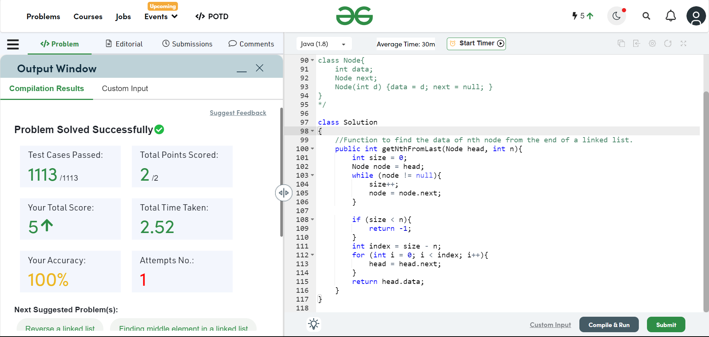

# Home work 3: Abstract Data Type (ADT) and List ADT
> Lưu ý dành cho sinh viên: trước khi chạy chương trình, chương trình ở trong package có import các package khác nhau trong bài. nên tải và giải nén tất cả package trong 1 file tránh trường hợp bị lỗi "Ngớ ngẩn" trong quá trình chạy thử chương trình. Chú ý đọc package mà lớp sử dụng để hiểu được luồng chương trình
> 
> package image chứa các ảnh hiển thị kết quả phục vụ cho file `README.md`
> 
> package `linkedlist` chứa lớp `LinkedList` và `Node` được build sẵn nhằm phục vụ cho việc kiểm tra chương trình
> 
> Các file trong bài tập lần này đều được biến đổi đôi chút để dễ dàng sử dụng. Các bài tập từ các trang có phần submit đều được hiển thị kết quả và đoạn code dùng để submit, trong trường hợp muốn kiểm tra lại chương trình có thể copy đoạn code và submit trên hệ trang
#### Bài tập 01
Bài tập cơ bản đã hoàn thiện các yêu cầu của để bài. Chạy file `Main.java` trong package `exercise01` để test chương trình  

#### Bài tập 02
Ngoài các phương thức được yêu cầu, có thêm phương thức `generateIntegerArrayList()` để khởi tạo ngẫu nhiên 1 List

Phương thức khởi tạo cho phép truyền vào một mảng các dữ liệu vào Array List luôn thay vì phải thêm từng phần thử vào trong

#### Bài tập 03

#### Bài tập 04
Chương trình tạo các đối tượng `WordCount` và lưu trữ trong một `ArrayList`

Chương trình đọc văn bản từ đường dẫn hoặc đoạn văn bản được người dùng nhập vào. Thực hiện tiền xử lý để loại bỏ dấu câu và chuyển về 1 dạng.

Với mỗi chữ sẽ được tạo đối tượng `WordCount` mới. Nếu đối tượng đã tồn tại thì tăng `count` lên 1 đơn vị bằng phương thức `count` 
#### Bài tập 05
> Trong bài tập này code submit sẽ chỉ ghi trong hàm `main` các phương thức khác vui lòng xem trong các file tương ứng
> 
> Code tại file `Main.java` Để test chương trình nhanh

Lớp `Node` và lớp `LinkedList` được định nghĩa như sau:

Lưu ý là các phương thức dưới đây là được tái sử dụng nhiều với các phương thức khác xem thêm ở File `LinkedList.java`
```java
class Node {
    int val;
    Node next = null;

    public Node(int val) {
        this.val = val;
    }

    public Node(int val, Node next) {
        this.val = val;
        this.next = next;
    }
}

class LinkedList {
    private Node head;
    private int size = 0;

    // Constructor without a return type
    public LinkedList() {

    }

    public void add(int data) {
        if (head == null){
            head = new Node(data);
        } else {
            Node node = head;
            while (node.next != null) {
                node = node.next;
            }
            node.next = new Node(data);
        }
        size++;
    }

    public void display() {
        Node node = head;
        while (node != null) {
            System.out.print(node.val + " ");
            node = node.next;
        }
    }
}
```
* Bài 21 
```java
public class Solution{
    public static void main(String[] args) {
        Scanner input = new Scanner(System.in);
        int size = input.nextInt();
        LinkedList list = new LinkedList();
        for (int i = 0; i < size; i++) {
            list.add(input.nextInt());
        }
        input.close();
        list.display();
    }
}
```
Kết quả khi submit chương trình:


* Bài 22
```java
public class Solution{
    public static void main(String[] args) {
        Scanner    input = new Scanner(System.in);
        int        size  = input.nextInt();
        LinkedList list  = new LinkedList();
        for (int i = 0; i < size; i++) {
            list.add(input.nextInt());
        }
        int k = input.nextInt();
        int x = input.nextInt();
        list.insert(k, x);

        list.display();
    }
}
```


Kết quả khi submit chương trình


* Bài 23
```java
public class Solution{
     public static void main(String[] args) {
        Scanner    input = new Scanner(System.in);
        int        size  = input.nextInt();
        LinkedList list  = new LinkedList();
        for (int i = 0; i < size; i++) {
            list.add(input.nextInt());
        }
        int k = input.nextInt();
        list.remove(k);
        list.display();
    }
}
```

Kết quả khi submit chương trình:


* Bài 24
```java
public class Solution{
    public static void main(String[] args) {
        Scanner    input = new Scanner(System.in);
        int        size  = input.nextInt();
        LinkedList list  = new LinkedList();
        for (int i = 0; i < size; i++) {
            list.add(input.nextInt());
        }
        int index = input.nextInt();
        System.out.println(list.get(index));
    }
}
```
Kết quả khi submit chương trình:


* Bài 25
```java
public class Solution{
    public static void main(String[] args) {
        Scanner    input = new Scanner(System.in);
        int        size  = input.nextInt();
        LinkedList list  = new LinkedList();
        for (int i = 0; i < size; i++) {
            list.add(input.nextInt());
        }
        int oldData = input.nextInt();
        int newData = input.nextInt();
        list.replace(oldData, newData);

        list.display();
    }
}
```
Kết quả khi submit chương trình:


* Bài 26

```java
import java.util.Scanner;

public class Solution {
    public static void main(String[] args) {
        Scanner    input = new Scanner(System.in);
        int        size  = input.nextInt();
        LinkedList list  = new LinkedList();
        for (int i = 0; i < size; i++) {
            list.add(input.nextInt());
        }

        list.removeBigger(input.nextInt());

        list.display();
    }
}
```
Kết quả khi submit chương trình:


* Bài 27
Lớp `DualNode` và lớp `DualLinkedList`
```java
public class DualNode {
    int data;
    DualNode prev;
    DualNode next;

    public DualNode(int data) {
        this.data = data;
        this.prev = null;
        this.next = null;
    }

    public DualNode(DualNode prev, int data, DualNode next) {
        this.data = data;
        this.prev = prev;
        this.next = next;
    }

    public DualNode(int data, DualNode next) {
        this.data = data;
        this.next = next;
        this.prev = null;
    }

    public DualNode( DualNode prev, int data) {
        this.data = data;
        this.next = null;
        this.prev = prev;
    }
}


```

```java
import java.util.Scanner;

public class Solution{
    public static void main(String[] args) {
        Scanner input = new Scanner(System.in);
        DualLinkedList list = new DualLinkedList();
        int size = input.nextInt();
        for (int i = 1; i <= size; i++){
            if (i == 1){
                list.add(i);
            }else {
                list.add(i);
                list.addHead(i);
            }
        }
        System.out.println(list);
    }
}
```
Kết quả khi submit chương trình:


* Bài 28

```java
import java.util.Scanner;

public class Solution{
    public static void main(String[] args) {
        Scanner input = new Scanner(System.in);
        DualLinkedList list = new DualLinkedList();
        int size = input.nextInt();
        for (int i = 1; i <= size; i++){
            list.add(input.nextInt());
        }
        int index = input.nextInt();
        int data = input.nextInt();
        list.insert(index, data);
        System.out.println(list);
    }
}
```
Kết quả khi submit chương trình:

* Bài 29
```java
import java.util.Scanner;

public class Solution{
    public static void main(String[] args) {
        Scanner input = new Scanner(System.in);
        DualLinkedList list = new DualLinkedList();
        int size = input.nextInt();
        for (int i = 1; i <= size; i++){
            list.add(input.nextInt());
        }
        int index = input.nextInt();
        list.remove(index);
        System.out.println(list);
    }
}
```

Kết quả khi submit chương trình:


#### Bài tập 06

#### Bài tập 07
Bài làm được import sẵn Linked list ở trong package phụ để tránh phải viết lại đoạn code một cách không cần thiết

Linked list trong package phụ có hàm size được xây dựng sẵn được tăng lên mỗi khi add phần tử nên về cơ bản sẽ đúng hơn. có thể dùng để so sanh kết quá

Kết quả khi submit code trên trang:


#### Bài tập 08
Bài làm được import sẵn Linked list ở trong package phụ để tránh phải viết lại đoạn code một cách không cần thiết

Kết quả khi submit code trên trang:

#### Bài tập 09
Bài làm được import sẵn linked list ở trong package phụ để tránh phải viết lại đoạn code một cách không cần thiết

Kết quả khi submit code trên trang:


#### Bài tập 10
Bài làm được import sẵn linked list ở trong package phụ để tránh phải viết lại đoạn code một cách không cần thiết

#### Bài tập 11
Bài làm được import sẵn linked list ở trong package phụ để tránh phải viết lại đoạn code một cách không cần thiết

Với chương trình dược submit trên leetcode có thay đổi ở tên đối tượng Node thành ListNode và thuộc tính data trong Node thành val

Dưới đây là chương trình dùng để submit 

```java
class Solution {
    // Helper function to reverse a linked list
    public ListNode reverseLinkedList(ListNode node){
        ListNode prev = null;
        while (node != null) {
            ListNode nextNode = node.next;
            node.next = prev;
            prev = node;
            node = nextNode;
        }
        return prev;
    }

    public boolean isPalindrome(ListNode head) {
        // Find the middle of the linked list using the slow and fast pointer technique
        ListNode slow = head;
        ListNode fast = head;
        while (fast != null && fast.next != null) {
            slow = slow.next;
            fast = fast.next.next;
        }

        // Reverse the second half of the linked list
        ListNode secondHalf = reverseLinkedList(slow);

        // Compare the reversed second half with the first half
        ListNode firstHalf = head;
        while (secondHalf != null) {
            assert firstHalf != null;
            if (firstHalf.val != secondHalf.val) {
                return false;
            }
            firstHalf = firstHalf.next;
            secondHalf = secondHalf.next;
        }

        return true;
    }
}
```

Kết quả khi submit code trên leetcode.

#### Bài tập 12

#### Bài tập 13

#### Bài tập 14

#### Bài tập 15

#### Bài tập 16

#### Bài tập 17