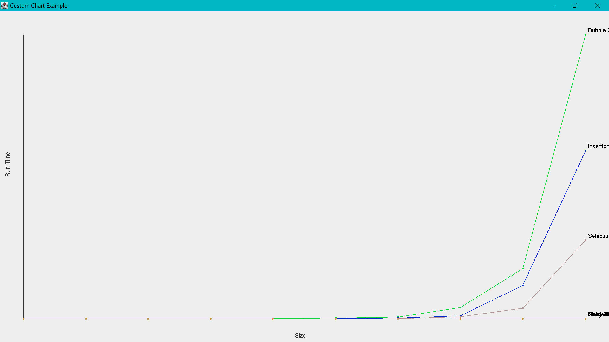

# Homework 6: Priority Queue and Heap

**** Exercise 01:
Trong bài tập này test được đặt tại lớp `Main.java`. Các phương thức test đã được tự động hóa và chuyển thành random để người xem dễ dạng quan sát hơn

Phương thức `test01()` thực hiện kiểm tra đơn giản với key là 1 số nguyên, và element là Character.

Phương thức `test02()` thực hiện kiểm tra như yêu cầu đầu tiên tại phần e.

Phương thức `test03()` thực hiện kiểm tra với element là một đối tượng People và với key là id

Trừ phương thức kiểm tra số 3 còn lại các phương đều có tham số giới hạn truyền vào

Các phương thức này sẽ kiểm tra 2 tham số đầu tiên là `isArray` và `sort` nếu `isArray = true` thì sẽ test 1 trong 2 lớp array và ngược lại.
Nếu `sort = true` thì sẽ tiến hành kiểm tra Queue đã được sắp xếp và ngược lại nếu `fasle`

- Ý tưởng khi thêm vào queue:
  + Với queue không sắp xếp: Sẽ thêm vào phần tử cuối cùng của danh sách hoặc `tail` với `linkedQueue`
  + Với queue sắp xếp: nếu `queue` đang rỗng thì sẽ gán luôn phần tử đầu tiên hoặc `head` với `linkedQueue`. Nếu sai sẽ tìm vị trí thích hợp tương tự như thuật toán selection sort
- Khi remove min:
  + Với `ArrayQueue` tìm phần tử nhỏ nhất (với `sortedQueue` thì là phần tử đầu tiên) sau đó dịch tất cả các phần tử sang bên trái.
  + Với `LinkedQueue` tìm phần tử nhỏ nhất sau đó xóa nó khỏi `queue` bằng cách khiến cho phần tử chỏ đến nó sẽ chỏ đến phần tử mà nó chỏ đến.

#### Exercise 02:
Trong bài tập này test được đặt tại lớp `Main.java`. Phương thức `upHead()` thực hiện vun đống và phương thức `downHeap()` thực hiện xóa đi phần tử ở gốc.

- Ý tưởng vun đống:
  + Bởi vì mỗi khi thêm một phần tử mới sẽ luôn thực hiện vun đống cho nên mỗi khi thêm vào sẽ luôn đảm bảo tính đống. Ngược lại nếu như thêm hết rồi mới vun đống sẽ gây ra vấn đề là sẽ khiến cho Heap sẽ có cây con bên trái/ phải (của gốc) không thỏa mãn tính đống
  + Thực hiện so sánh, với lớp cha của node phần tử thêm vào, nếu như không có node nào có key nhỏ hơn hoặc đã ở gốc thì sẽ dừng việc vun đống.
- Ý tưởng loại phân tử bé nhất:
  + Phần tử bé nhất luôn là gốc, nên việc cần là đổi chỗ với phần tử cuối cùng trong heap sau đó xóa phần tử cuối rồi thực hiện vun đống ngược
  + Vun đống ngược: thay vì hoán đổi với lớp cha và thực hiện từ lá, chương trình thực hiện đổi chỗ với node con nhỏ nhất -> các cây con vẫn đảm bảo tính đống.

#### Exercise 03:

- Trong bài này test thuật toán được đặt tại lớp `Main.java`. Khởi tạo ngẫu nhiên 2 kiểu dữ liệu là `Double` và `String`, với `key` chính là `value`. 
- Ý tưởng thuật toán `Heap Sort` khi thực hiện sắp xếp vun đống, chúng ta sẽ thực hiện tương tự như khi chúng ta vun đống với mảng ban đầu sau đó lấy từng phần tử nhỏ nhất ra nhét ngược vào trong mảng.
- Thực hiện test với `n` lần trên cùng một mảng sau đấy kiểm tra xem kết quả giữa các thuật toán có giống nhau không. Nếu có 1 thuật toán sai sẽ in ra mảng lỗi và thông báo.

- Vẽ biểu đồ được thực hiện tại lớp `App.java` Thực hiện tạo ngẫu nhiên 1 mảng `Integer` sau đấy thực hiện sắp xếp lần lượt các dữ liệu đo thời gian rồi trả về dữ liệu và vẽ lên màn hình.
- Vì kết quả khá khó nhìn và lâu nên em/ mình sẽ để kết quả ở đây.

#### Exercise 04:

#### Exercise 05:
> Trong bài này test được tạo tại lớp `AirportSystem.java`.
- Đối tượng trừu tượng `Event` có thuộc tính `id` được tạo ngẫu nhiên tương ứng với mã của chuyến bay
- Đối tượng Time được tạo và triển khai giao diện Comparable để so sánh xem thời gian cái nào trước

- Khi thêm sự kiện mới:
  + Khi thêm một sự kiện mới: Khi thêm sự kiện sẽ xem xét tạo ngẫu nhiên một sự kiện (cất/hạ cánh). 
  + Khi thêm vào hệ thống, hệ thống sẽ hiển thị sự kiện kèm theo mã số của chuyến bay để nhân viên biết
- Khi thực hiện một sự kiện:
  + Thực hiện xóa phần tử đầu tiên của queue sau đó dịch sang trái (tương tự như queue bình thường)
  + Sau đó trả về giá trị của mảng